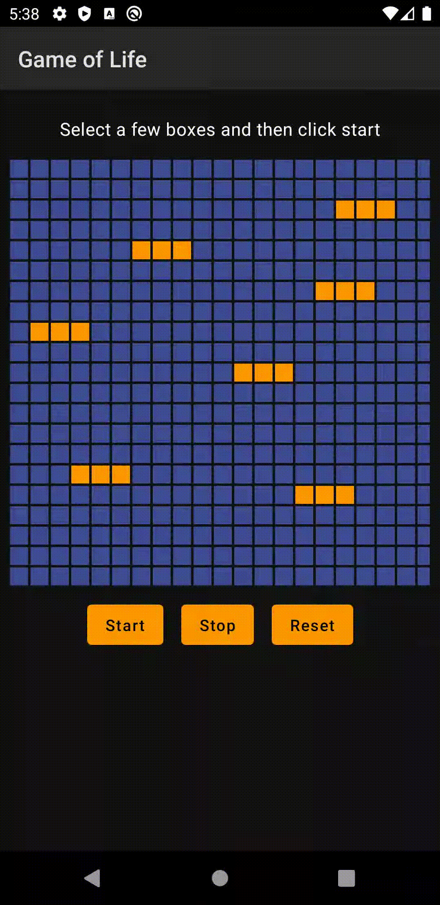
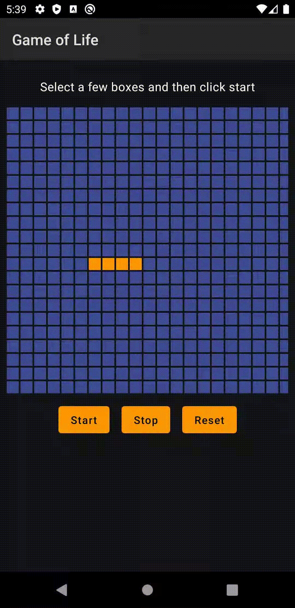
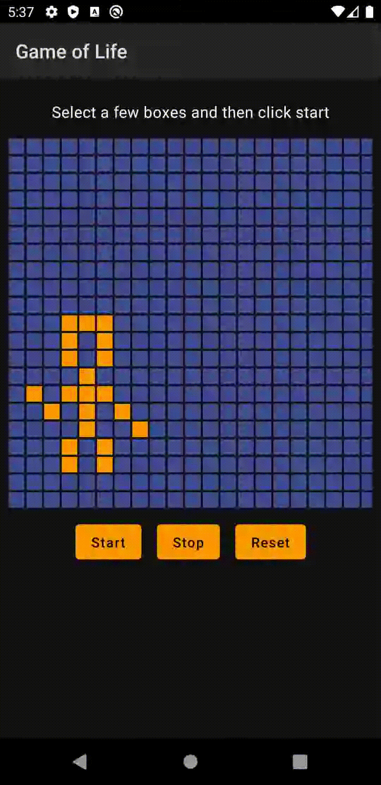

## Game of life

This is a simple simulation for the [Game of life](https://en.wikipedia.org/wiki/Conway%27s_Game_of_Life) by [John Conway](https://en.wikipedia.org/wiki/John_Horton_Conway) written in [JetPack Compose](https://developer.android.com/jetpack/compose)

Try on your android device by downloading this [file](app-release.apk)

#### The Rules

- For a space that is 'populated':
    - Each cell with one or no neighbors dies, as if by solitude.
    - Each cell with four or more neighbors dies, as if by overpopulation.
    - Each cell with two or three neighbors survives.
- For a space that is 'empty' or 'unpopulated'
    - Each cell with three neighbors becomes populated.

### Interesting simulations:

##### Repeating patterns

##### Stable states

##### John Conway [xkcd](https://xkcd.com/2293/)

